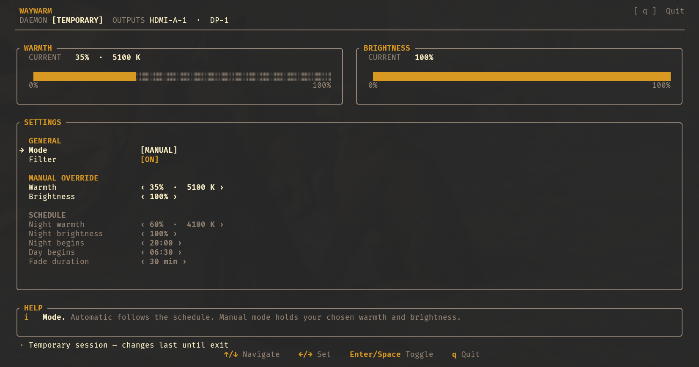

<div align="center">

# Waywarm

**A small, friendly blue-light filter for wlroots-based Wayland desktops.**

[](https://github.com/KLAMBO365/waywarm/actions/workflows/ci.yml)
[](https://github.com/KLAMBO365/waywarm/releases)
[](LICENSE)
[](https://www.rust-lang.org/)

Control warmth, brightness, and smooth automatic transitions from a GTK settings
window or an optional terminal UI.



</div>

## Highlights

- Live warmth and brightness controls
- Automatic schedules with separate day and night targets
- Optional location timing from civil dawn and dusk
- Named presets for quick profile switching
- Optional StatusNotifier tray for toggle without the settings UI
- Smooth transitions between day and night
- Standalone mode or an optional systemd user service
- Immediate, persistent settings

## Install

Requires Linux **x86_64** and a compositor supporting
`wlr-gamma-control-unstable-v1`. The curl installer and prebuilt release
binary are x86_64 only; other architectures need a source build.

Install or update to the latest release with:

```sh
curl --proto '=https' --tlsv1.2 -fsSL https://raw.githubusercontent.com/KLAMBO365/waywarm/main/install.sh | sh
```

The installer downloads the release, verifies its SHA-256 checksum, and installs
`waywarm` to `~/.local/bin`. Ensure that directory is in your `PATH`, then launch:

```console
waywarm
```

For automatic startup, open the service manager and choose
**Install or update and start**:

```console
waywarm daemon
```

<details>
<summary>Manual installation</summary>

Download the archive and checksum from the
[latest release](https://github.com/KLAMBO365/waywarm/releases/latest), then:

```console
sha256sum -c waywarm-*.tar.gz.sha256
tar -xzf waywarm-*.tar.gz
install -Dm755 waywarm-*/waywarm ~/.local/bin/waywarm
```

</details>

<details>
<summary>Build from source (Rust 1.88+)</summary>

Needs GTK 4 and libadwaita development packages (for example
`libgtk-4-dev` and `libadwaita-1-dev` on Debian/Ubuntu, or `gtk4-devel` and
`libadwaita-devel` on Fedora).

```console
git clone https://github.com/KLAMBO365/waywarm.git
cd waywarm
make install
```

</details>

## Compatibility

Works with wlroots compositors such as **Sway**, **river**, and **Wayfire**.
GNOME, KDE Plasma, and newer Hyprland versions are not supported.

> [!IMPORTANT]
> Gamma control is exclusive. Stop `gammastep`, `wlsunset`, or similar tools
> before starting Waywarm. The daemon reports competing clients and failed
> outputs in `waywarm status` and the settings UI.

## Configuration

Settings are stored at `~/.config/waywarm/config.toml` (or
`$XDG_CONFIG_HOME/waywarm/config.toml`). The settings UI and CLI update this
file immediately when you change options.

## Settings UI

`waywarm` opens the GTK dashboard. Use the switches, sliders, and preset
controls to change filter mode, levels, and schedule. Changes are applied and
saved immediately.

For the terminal interface:

```console
waywarm tui
```

In the TUI, use arrow keys or `h`/`j`/`k`/`l` to navigate and adjust values.
Press `Space` or `Enter` to toggle options, and `q` or `Esc` to quit. On the
Preset row: `←`/`→` choose, `Enter` apply, `s` save (type a name), `d` delete
(confirm with `Enter`/`y`).

## CLI

Scriptable commands talk to a running daemon (the optional service, or an open
settings UI). They fail clearly if nothing is listening.

```console
waywarm status
waywarm status --json
waywarm toggle
waywarm enable
waywarm disable
waywarm set --warmth 40 --brightness 90
waywarm set --mode automatic
waywarm set --day-warmth 10 --night-warmth 55
waywarm set --night-start 21:30 --transition 45
waywarm set --timing location --latitude 48.8566 --longitude 2.3522
waywarm preset save reading
waywarm preset apply reading
waywarm preset list
```

`set` updates and saves configuration the same way as the settings UI. Manual
`--warmth` / `--brightness` switch into enabled manual mode unless you also
pass `--mode`. Use `--timing location` with `--latitude` / `--longitude` to
follow civil dawn and dusk (fixed clock times remain the fallback). Presets
store mode, levels, and schedule (not the filter on/off toggle). Use
`--json` on `status`, `set`, `enable`, `disable`, or
`toggle` for machine-readable output (`RuntimeState` fields may grow over
time).

## Tray

With a running daemon and a StatusNotifier host (for example Waybar, Swaybar,
or a desktop panel), start a tray icon:

```console
waywarm tray
```

Left-click toggles the filter. The menu can toggle, open the settings UI, or
quit the tray process (the display daemon keeps running).

## License

[MIT](LICENSE)
